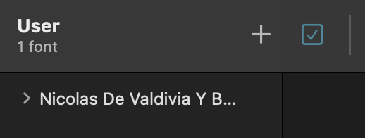

# KGSAR: A knowledge graph for 17th Spanish American Notary Records

# Acknowledgments
This work was supported by the National Endowments for the Humanities Grant No. [HAA-271747-20](https://securegrants.neh.gov/publicquery/main.aspx?f=1&gn=HAA-271747-20).

# Installing font locally
This virtual keyboard will work on your browser, even if the font has not been installed locally. To be able to work offline with this, please follow the instructions below.

1. Install the .ttf file by cloning this repository or downloading from [here](https://github.com/MU-Data-Science/KGSAR/blob/main/font/Spanish-DeCray.ttf).
2. Navigate to the folder where the .ttf has been cloned or downloaded.
3. Double click on the .ttf file and click on "Install Font" (shown in the image below).
 

The font installation is now complete!

To verify, in your Font Book, find and ensure the tick box is highlighted in blue color.
    
